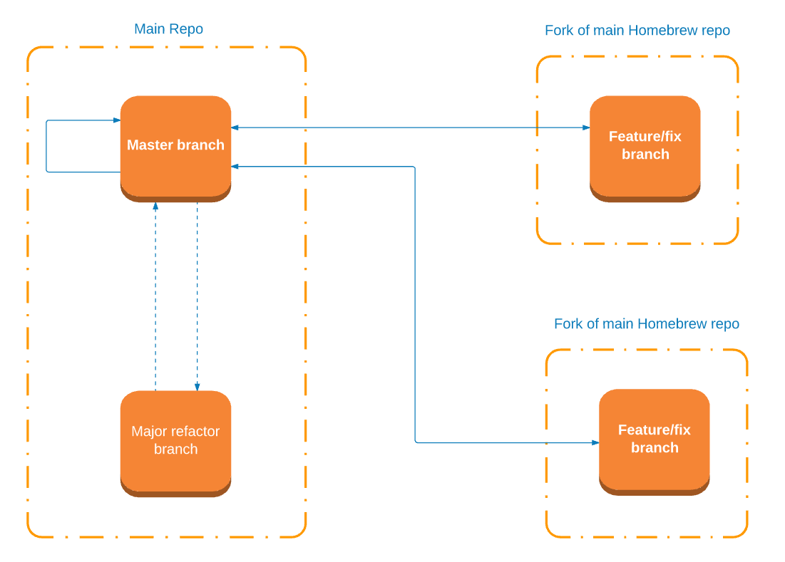
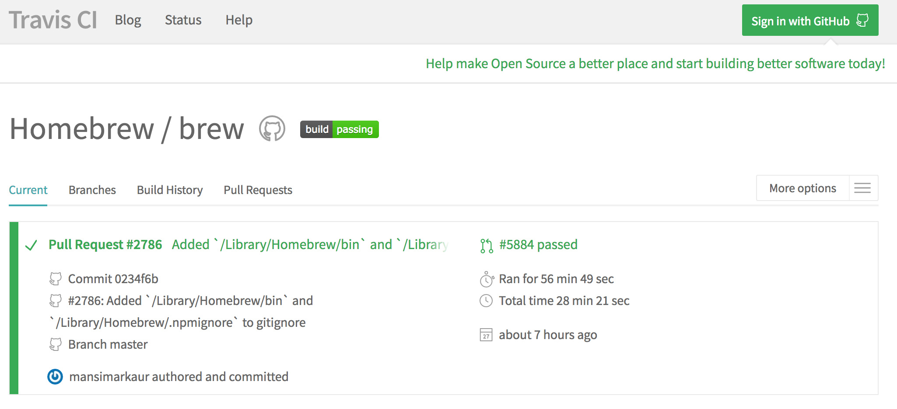
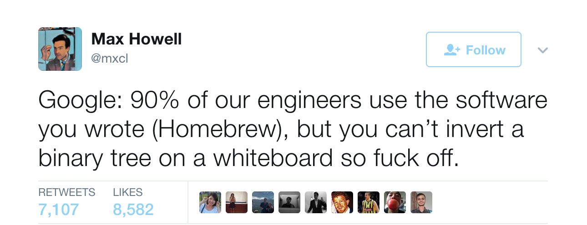

autoscale: true
theme: Poster, 7
build-lists: false

# Homebrew *


#### by Ilya Krasnov @ June 15, 2017
[.footer: *[the missing package manager for macOS](https://brew.sh/)]

---
## Stakeholders
---

* Users (mostly developers)
* Maintainers 
* Upstream package maintainers

---

## Use Case

---
## Set Up My Mac

```bash
brews=(
  coreutils
  git
  htop
  node
  postgresql
  python
…
)
…
prompt "Install packages"
brew info ${brews[@]}
install 'brew install' ${brews[@]}
```


---
## Open Source

—

# 4462 - 6 - 7

---

## Contributing

---



—-—

## Architecture - Let’s explore first

---

* Keg
* Cellar
* Tap
* Formula


---

## Formula

---

```ruby
class Node < Formula
  desc "Platform built on V8 to build network applications"
  homepage "https://nodejs.org/"
  url "https://nodejs.org/dist/v8.1.1/node-v8.1.1.tar.xz"
  sha256 "7b0d176dc4a1db37789e009825ba03d2e3f834227e5efd296167e7ef6b287847"
  head "https://github.com/nodejs/node.git"

…
  # We track major/minor from upstream Node releases.
  # We will accept *important* npm patch releases when necessary.
  resource "npm" do
    url "https://registry.npmjs.org/npm/-/npm-5.0.3.tgz"
    sha256 "de62206d779afcba878b3fb949488c01be99afc42e3c955932e754c2ab9aec73"
  end

  def install
    …
  end

  def post_install
    …
    end

    npm_root = node_modules/"npm"
    npmrc = npm_root/"npmrc"
    npmrc.atomic_write("prefix = #{HOMEBREW_PREFIX}\n")
  end

  def caveats
    if build.without? "npm"
      <<-EOS.undent
        Homebrew has NOT installed npm. If you later install it, you should supplement
        your NODE_PATH with the npm module folder:
          #{HOMEBREW_PREFIX}/lib/node_modules
      EOS
    end
  end

  test do
    path = testpath/"test.js"
    path.write "console.log('hello');"

    …    if build.with? "icu4c"
      output = shell_output("#{bin}/node -e 'console.log(new Intl.NumberFormat(\"de-DE\").format(1234.56))'").strip
      assert_equal "1.234,56", output
    end

    if build.with? "npm"
      # make sure npm can find node
      …
    end
  end
end
```

---

## Testing



```ruby
describe Tap do
…
 describe "#install" do
    it "raises an error when the Tap is already tapped" do
      setup_git_repo
      already_tapped_tap = described_class.new("Homebrew", "foo")
      expect(already_tapped_tap).to be_installed
      expect { already_tapped_tap.install }.to raise_error(TapAlreadyTappedError)
    end
 end
…
end
```

---


